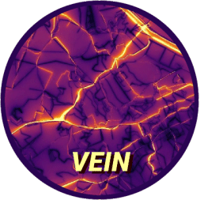

<!-- README.md is generated from README.Rmd. Please edit that file -->
<!-- date: "19 de Octubre de 2016" -->

```{r, echo = FALSE}
knitr::opts_chunk$set(
  collapse = TRUE,
  comment = "#>",
  fig.path = "man/figures/"
)
```

# VEIN 


* build:
[](https://ci.appveyor.com/project/ibarraespinosa/vein)
[](https://codecov.io/github/atmoschem/vein?branch=master)
* cran:
[](http://cran.rstudio.com/web/packages/vein/index.html)
[](http://cran.r-project.org/web/packages/vein) 
[](http://cran.r-project.org/package=vein)
[](https://www.tidyverse.org/lifecycle/#maturing)

* doi:
[](https://zenodo.org/badge/latestdoi/88201850)
* github:
[](https://github.com/atmoschem/vein)


<!--  -->

[](https://github.com/atmoschem/vein/actions)


<!--  -->


# **V**ehicular **E**missions **IN**ventories (VEIN)


### TODO

- get_project with Chinese EF
- Include speed functions with Fortran
- Include CB6
- Add EF from HBEFA?
- See issues [GitHub](https://github.com/atmoschem/vein/issues) and [GitLab](https://gitlab.com/ibarraespinosa/vein/-/issues)


### System requirements

vein imports functions from spatial packages listed below. In order to
install these packages, firstly the user must install the requirements
mentioned [here](https://www.github.com/r-spatial/sf).

### Installation

#### CRAN

VEIN can be installed via CRAN or github
```r
install.packages("vein")
```

#### GitHub

```r
remotes::install_github("atmoschem/vein")
```

or if you have a **32 bits** machine

```r
install_github("atmoschem/vein",
INSTALL_opts = "--no-multiarch")
```
---

#### demo

Then, if you want, run the demo
```r
library(vein) 
demo(VEIN)
```
###

## Approaches

### 1. get a project (easier)

At the moment, most of the projects covers Brazilian regions, but I will include China, Europe or USA approaches as soon as I can.

Use the function [get_project](https://atmoschem.github.io/vein/reference/get_project.html) and read the documentation, there you can see more projects as well.

- [](https://github.com/atmoschem/vein/actions)
- [](https://github.com/atmoschem/vein/actions)
- [](https://github.com/atmoschem/vein/actions)
- [](https://github.com/atmoschem/vein/actions)
- [](https://github.com/atmoschem/vein/actions)
- [](https://github.com/atmoschem/vein/actions)
- [](https://github.com/atmoschem/vein/actions)
- [](https://github.com/atmoschem/vein/actions)
- [](https://github.com/atmoschem/vein/actions)
- [](https://github.com/atmoschem/vein/actions)
<!-- - [](https://github.com/atmoschem/vein/actions) -->
<!-- - [](https://github.com/atmoschem/vein/actions) -->
- [](https://github.com/atmoschem/vein/actions)
- [](https://github.com/atmoschem/vein/actions)
- [](https://github.com/atmoschem/vein/actions)
- [](https://github.com/atmoschem/vein/actions)
- [](https://github.com/atmoschem/vein/actions)
- [](https://github.com/atmoschem/vein/actions)
- [](https://github.com/atmoschem/vein/actions)
- [](https://github.com/atmoschem/vein/actions)


```r
library(vein)
?get_project
get_project(directory = "awesome_city")

```

The structure of the new directory "awesome_city" is:


```r
awesome_city
├── config
│   ├── clean.R
│   ├── config.R
│   ├── inventory.xlsx
│   └── packages.R
├── main.R
├── main.Rproj
├── network
│   ├── net.gpkg
│   └── net.rds
├── scripts
│   ├── evaporatives.R
│   ├── exhaust.R
│   ├── fuel_eval.R
│   ├── net.R
│   ├── pavedroads.R
│   ├── plots.R
│   ├── post.R
│   ├── traffic.R
│   └── wrf.R
└── wrf
└── wrfinput_d02
```

You have to open the file `main.Rproj` with Rstudio and then open and run `main.R`

To run `main.R` you will need these extra packages:

- ggplot2
- readxl
- eixport (If you plan to generate WRF Chem emissions file)

If you do not have them already, you can install:


```{r, eval = F}
install.packages(c("ggplot2", "readxl", "eixport"))
```

## Too complicated? Watch a YouTube

<iframe width="560" height="315" src="https://www.youtube.com/embed/tHSWIjg26vg" frameborder="0" allow="accelerometer; autoplay; clipboard-write; encrypted-media; gyroscope; picture-in-picture" allowfullscreen></iframe>
[English](https://www.youtube.com/embed/tHSWIjg26vg)

<iframe width="560" height="315" src="https://www.youtube.com/embed/6-07Y0Eimng" frameborder="0" allow="accelerometer; autoplay; clipboard-write; encrypted-media; gyroscope; picture-in-picture" allowfullscreen></iframe>
[Portuguese](https://www.youtube.com/watch?v=6-07Y0Eimng)


Spanish coming soon!

### 2. Use inventory (a bit not so easy)

Read the instruction of inventory
```r
?inventory
```

#### 1) Examples with traffic data:

1. If you know the distribution of the vehicles by age of use , use:  [my_age](https://atmoschem.github.io/vein/reference/my_age.html)
2. If you know the sales of vehicles or better the registry of new vehicles,
use [age](https://atmoschem.github.io/vein/reference/age.html) to apply a survival function.
3. If you know the theoretical shape of the circulating fleet and you can use
[age_ldv](https://atmoschem.github.io/vein/reference/age_ldv.html),
[age_hdv](https://atmoschem.github.io/vein/reference/age_hdv.html) or 
[age_moto](https://atmoschem.github.io/vein/reference/age_moto.html). 
For instance, you dont know the sales or registry of vehicles, but somehow you know
the shape of this curve.
4. You can use/merge/transform/adapt any of these functions.


```{r, fig.height=8, fig.width=6}
library(vein)
data("net")
PC_E25_1400 <- age_ldv(
  x = net$ldv
)
plot(
  PC_E25_1400
)
```


If you want to know the vehicles per street and by age of use, just
add the net. Age functions now returns 'sf' objects if the net argument is present.

```{r, fig.height=5, fig.width=7}
PC_E25_1400net <- age_ldv(
  x = net$ldv, 
  net = net
)
plot(
  PC_E25_1400net, 
  key.pos = 4, 
  pal = cptcity::cpt(
    colorRampPalette = T, 
    rev = T
  )
)
```

- [temp_fact](https://atmoschem.github.io/vein/reference/temp_fact.html)
- [netspeed](https://atmoschem.github.io/vein/reference/netspeed.html)

temporal factors and netspeed

```{r, fig.height=8, fig.width=6}
data("net")
data("pc_profile")
pc_week <- temp_fact(
  net$ldv + net$hdv, 
  pc_profile
)
dfspeed <- netspeed(
  q = pc_week, 
  ps = net$ps, 
  ffs = net$ffs, 
  cap = net$capacity, 
  lkm = net$lkm, 
  alpha = 1.5
)
plot(dfspeed)

```

If you want ot check the speed at different hours by street, just add net:

```{r, fig.height=4, fig.width=8}
dfspeednet <- netspeed(
  q = pc_week, 
  ps = net$ps, 
  ffs = net$ffs, 
  cap = net$capacity, 
  lkm = net$lkm,
  alpha = 1.5, 
  net = net
)
plot(
  dfspeednet[, c("S1", "S9")], 
  key.pos = 4, 
  pal = cptcity::cpt(colorRampPalette = T, 
                     rev = T), 
  axes = T
)
```
#### 2) Emission Factors

- [ef_ldv_speed](https://atmoschem.github.io/vein/reference/ef_ldv_speed.html)
- [ef_hdv_speed](https://atmoschem.github.io/vein/reference/ef_hdv_speed.html)
- [ef_ldv_scaled](https://atmoschem.github.io/vein/reference/ef_ldv_scaled.html)
- [ef_hdv_scaled](https://atmoschem.github.io/vein/reference/ef_hdv_scaled.html)
- [EmissionFactors](https://atmoschem.github.io/vein/reference/EmissionFactors.html)
- [EmissionFactorsList](https://atmoschem.github.io/vein/reference/EmissionFactorsList.html)

```{r, fig.height=4, fig.width=6}
V <- 0:150
ef1 <- ef_ldv_speed(
  v = "PC",
  t = "4S", 
  cc = "<=1400", 
  f = "G",
  eu = "PRE",
  p = "CO"
)
efs <- EmissionFactors(ef1(1:150))
plot(
  Speed(1:150), 
  efs, 
  xlab = "speed[km/h]", 
  type = "b", 
  pch = 16
)
```

#### 3) Estimation of emissions

- [emis](https://atmoschem.github.io/vein/reference/emis.html)

```{r, fig.height=4, fig.width=6}
euro <- c(
  rep("V", 5), 
  rep("IV", 5), 
  rep("III", 5), 
  rep("II", 5),
  rep("I", 5), 
  rep("PRE", 15)
)
lef <- lapply(1:40, function(i) {
  ef_ldv_speed(
    v = "PC", 
    t = "4S",
    cc = "<=1400", 
    f = "G",
    eu = euro[i], 
    p = "CO", 
    show.equation = FALSE
  ) 
})
E_CO <- emis(
  veh = PC_E25_1400, 
  lkm = net$lkm, 
  ef = lef, 
  speed = dfspeed,
  profile = pc_profile
)
```

#### 4) Post Emissions

- [emis_post](https://atmoschem.github.io/vein/reference/emis_post.html)
- When the argument by = "veh" the emissions are aggregated by age and 
hour.
- When the argument by = "streets_wide", aggregated the emissions
by street. In this cae, if you add the argument net with the respective streets,
it returns an spatial net with the hourly emissions.

```{r, fig.height=4, fig.width=8}
E_CO_DF <- emis_post(
  arra = E_CO,  
  veh = "PC", 
  size = "<1400", 
  fuel = "G",
  pollutant = "CO", 
  by = "veh", 
  type_emi = "exhaust"
)
E_CO_STREETS <- emis_post(
  arra = E_CO, 
  pollutant = "CO", 
  by = "streets", 
  net = net
)
plot(
  E_CO_STREETS[, c("V1", "V9")], 
  key.pos = 4, 
  pal = cptcity::cpt(colorRampPalette = T, 
                     rev = T), 
  axes = T)

```

#### Grids

- [make_grid](https://atmoschem.github.io/vein/reference/make_grid.html).


1) Create a grid using `make_grid`.The spobj is the spatial net. The size of
the grid has the size of the net. You have to specify the grid spacing.
2) Create a grid using a path to wrfinput file instead a net. The grid will have
the size of the wrf_input. You don't have to specify the grid spacing.

```{r, fig.height=4, fig.width=8}
data(net)
E_CO_STREETSnet <- emis_post(
  arra = E_CO, 
  pollutant = "CO",
  by = "streets_wide",
  net = net
)
g <- make_grid(
  spobj = net, 
  width = 1/102.47
)
E_CO_g <- emis_grid(
  spobj = E_CO_STREETSnet, 
  g = g, 
  sr= 31983
)
na <- paste0("V", 1:168)
for(i in 1:168) E_CO_g[[na[i]]] <- E_CO_g[[na[i]]] * units::set_units(1, "1/h")
plot(
  E_CO_g[, c("V1", "V9")], 
  key.pos = 4, 
  pal = cptcity::cpt(colorRampPalette = T, 
                     rev = T,
                     pal = "mpl_viridis"), 
  axes = T, 
  lty = 0
)
```


#### Creating a WRFChem Input file using [eixport](https://atmoschem.github.io/eixport/):

1. Create a grid using [make_grid](https://atmoschem.github.io/vein/reference/make_grid.html) and a wrfinput file
2. Run [emis_grid](https://atmoschem.github.io/vein/reference/emis_grid.html) to grid your emissions.
3. Create a [GriddedEmissionsArray](https://atmoschem.github.io/vein/reference/GriddedEmissionsArray.html).
4. Create a wrfchem input file [eixport::wrf_create](https://atmoschem.github.io/eixport/reference/wrf_create.html.
5. Put the [GriddedEmissionsArray](https://atmoschem.github.io/vein/reference/GriddedEmissionsArray.html)
into the wrf chem input file using [eixport::wrf_put](https://atmoschem.github.io/eixport/reference/wrf_put.html).

```r
library(eixport)
dir.create(file.path(tempdir(), "EMISS"))
wrf_create(wrfinput_dir         = system.file("extdata", package = "eixport"),
wrfchemi_dir         = file.path(tempdir(), "EMISS"),
domains              = 2,
frames_per_auxinput5 = 1, #hours
auxinput5_interval_m = 60,
verbose              = TRUE)
path_to_wrfi <- paste0(system.file("extdata", package = "eixport"), "/wrfinput_d02")
path_to_wrfc <- list.files(file.path(tempdir(), "EMISS"), full.names = TRUE)[1]
gwrf <- eixport::wrf_grid(path_to_wrfi)
E_CO_gwrf <- emis_grid(spobj = E_CO_STREETSnet, g = gwrf)
gr <- GriddedEmissionsArray(E_CO_gwrf, rows = 51, cols = 63, times = 1)
eixport::wrf_put(file = path_to_wrfc, name = "E_CO", POL = gr)
```

#### Creating a WRFChem Input file using AS4WRF

1. Create a grid using [make_grid](https://atmoschem.github.io/vein/reference/make_grid.html) and your net.
2. Run [emis_grid](https://atmoschem.github.io/vein/reference/emis_grid.html) to grid your emissions.
3. Run [eixport::to_as4wrf](https://atmoschem.github.io/eixport/reference/to_as4wrf.html) to create a 
data.frame the specifications for AS4WRF.ncl.
4. Export data.frame to a text.file. Recall that AS4WRF requires all the lumped species.
5. Contact the developer of AS4WRF Angel Vara alvv1986@gmail.com to get a copy and run AS4WRF.ncl.

Thanks and enjoy VEIN!

## Citation

If you use VEIN, please, cite it ([BIBTEX](https://gmd.copernicus.org/articles/11/2209/2018/gmd-11-2209-2018.bib), [ENDNOTE](https://gmd.copernicus.org/articles/11/2209/2018/gmd-11-2209-2018.ris)):

Ibarra-Espinosa, S., Ynoue, R., O'Sullivan, S., Pebesma, E., Andrade, M. D. F., and
Osses, M.: VEIN v0.2.2: an R package for bottom-up vehicular emissions inventories,
Geosci. Model Dev., 11, 2209-2229, https://doi.org/10.5194/gmd-11-2209-2018, 2018.

```
@article{gmd-11-2209-2018,
author = {Ibarra-Espinosa, S. and Ynoue, R. and O'Sullivan, S. and Pebesma, E. and Andrade, M. D. F. and Osses, M.},
title = {VEIN v0.2.2: an R package for bottom--up vehicular emissions inventories},
journal = {Geoscientific Model Development},
volume = {11},
year = {2018},
number = {6},
pages = {2209--2229},
url = {https://gmd.copernicus.org/articles/11/2209/2018/},
doi = {10.5194/gmd-11-2209-2018}
}
```

## Special thanks to all the contributors

[](https://github.com/atmoschem/vein/graphs/contributors)

## Communications, doubts etc

- Earth-Sciences on Stackoverflow, tag [vein-r-package](https://earthscience.stackexchange.com/questions/tagged/vein-r-package)
- Drop me an email sergio.ibarra@usp.br or zergioibarra@hotmail.com (你好中国朋友 - Hello Chinese friends!)
- Check the group on GoogleGroups [Group](https://groups.google.com/d/forum/veinmodel).
- Check the project on [ResearchGate](https://www.researchgate.net/project/VEIN-An-R-package-for-vehicular-emissions-inventories).

##  Issues

If you encounter any issues while using VEIN, please submit your issues to: https://github.com/atmoschem/vein/issues/
If you have any suggestions just let me know to sergio.ibarra@usp.br.


### Contributing

Please, read [this](https://github.com/atmoschem/vein/blob/master/CONTRIBUTING.md) guide.
Contributions of all sorts are welcome, issues and pull requests are the preferred ways of sharing them.
When contributing pull requests, please follow the [Google's R Style Guide](https://google.github.io/styleguide/Rguide.xml).
This project is released with a [Contributor Code of Conduct](https://github.com/atmoschem/vein/blob/master/CODE_OF_CONDUCT.md). By participating in this project you agree to abide by its terms.

### Note for non-english and anaconda users

Sometimes you need to install R and all dependencies and a way for doing that is using anaconda. Well, as my system is in portuguese, after installing R using anaconda it changed the decimal character to ','. In order to change it back to english meaning decimal separator as '.', I added this variable  into the .bashrc

```
nano ~/.bashrc
export Lang=C
```
More details on [StackOverflow](https://stackoverflow.com/questions/13575180/how-to-change-language-settings-in-r) 


<!-- You can learn more about VEIN reading the documentation in [PDF](https://cran.r-project.org/web/packages/vein/vein.pdf), [online](https://atmoschem.github.io/vein/), reading the book [online](https://ibarraespinosa.github.io/VEINBOOK/), or buy it in  [Kindle](https://www.amazon.com/VEINBOOK-Estimating-vehicular-emissions-package-ebook-dp-B07L7XRFKC/dp/B07L7XRFKC/ref=mt_kindle?_encoding=UTF8&me=&qid=) or  [Paperback](https://www.amazon.com/gp/product/1791571158?pf_rd_p=1581d9f4-062f-453c-b69e-0f3e00ba2652&pf_rd_r=EMDPZM3G7BWCHAD9F4QP) -->

<!--  -->
