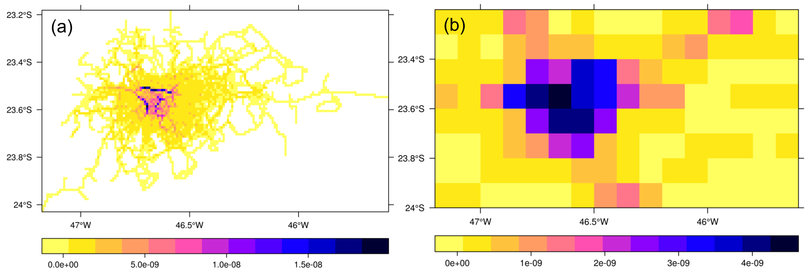

```{r setup, include=FALSE}
knitr::opts_chunk$set(echo = TRUE)
```

[](https://travis-ci.org/ibarraespinosa/vein)




## Vein Package

**V**ehicular **E**missions **IN**ventory **(VEIN)** model.  


Read the DESCRIPTION file. You need several packages to run **vein**.

- sp
- units
- raster
- rgdal
- rgeos

Also, if you want to properly run the demo, install these packages:

- ggplot2
- DiagrammeR
- RColorBrewer


```{r eval=F}
library(devtools)
install_github("ibarraespinosa/vein")
library(vein)
demo("VEIN")
```

I've created the following classes:

- Vehicles (1/h) 
- Speed  (km/h)
- EmissionFactors (g/km)
- EmissionFactorsList (g/km)
- Emissions  (g/h)
- EmissionsArray  (g/h)
- EmissionsList  (g/h)
- Evaporative  (g/d)

Each class has the methods print, plot and summary.

Soon, all units will be fully implemented in VEIN.

VEIN is currently in its testing phase - to identify software bugs and errors. 

New information will also be added to the documentation of emission factors.

If you encounter any issues while using VEIN, please submit your issues to: https://github.com/ibarraespinosa/vein/issues/

Thanks and enjoy VEIN!
